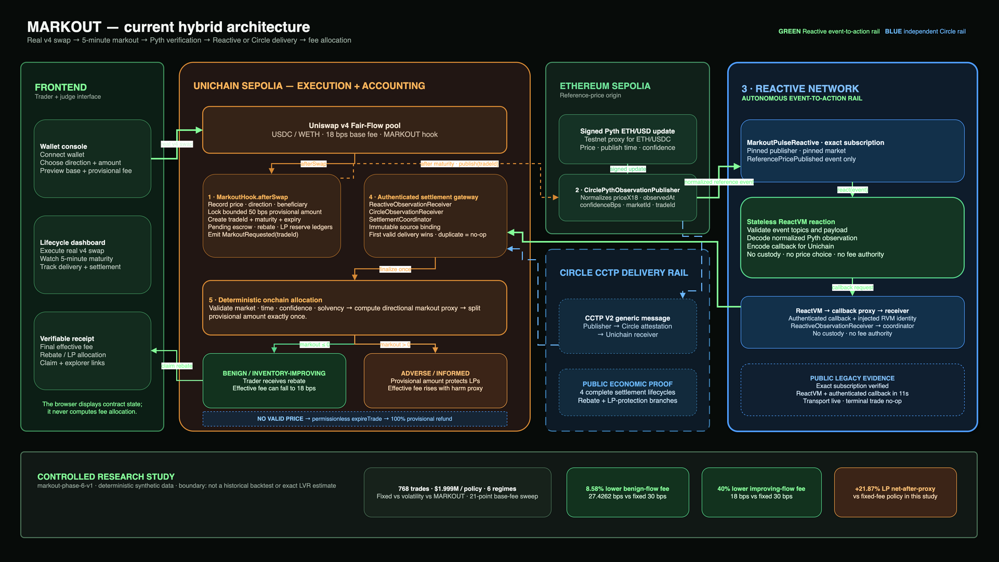

# MARKOUT

### Outcome-priced liquidity for Uniswap v4

MARKOUT is a Uniswap v4 hook that charges a trade according to its observed post-trade outcome. It combines a low
base fee with a bounded provisional surcharge, waits for a five-minute directional markout, and then allocates the
provisional amount between a trader rebate and LP protection.

[Live judge dashboard](https://markout-uhi10.vercel.app) ·
[Public evidence](docs/EVIDENCE.md) ·
[Mechanism specification](docs/MECHANISM.md) ·
[Presentation deck](presentation/MARKOUT-UHI10.pptx)

> **UHI10 theme:** Sustainable Liquidity and MEV Protection<br>
> **Status:** Experimental testnet prototype. Not audited and not suitable for real funds.



[Editable Draw.io architecture](docs/diagrams/MARKOUT_ARCHITECTURE.drawio) ·
[4K video export](docs/diagrams/MARKOUT_COMPLETE_ARCHITECTURE_4K.png) ·
[PDF export](docs/diagrams/MARKOUT_COMPLETE_ARCHITECTURE.pdf)

## The problem

AMMs normally set a fee before they know whether a swap was benign, inventory-improving, or followed by a favorable
price move for the trader. A volatility-linked fee can compensate LPs, but it raises prices for every trader during a
volatile period - even when an individual trade was harmless.

MARKOUT tests a different mechanism:

- charge a low base fee at execution;
- escrow a strictly bounded provisional amount;
- observe a signed reference price after a fixed horizon;
- use **directional markout as a risk proxy**, not as a claim of exact LP loss;
- refund fair flow and retain more from adverse flow for LP protection.

The mechanism evaluates outcomes rather than wallets. It uses no allowlist, identity score, or trader blacklist.

## How it works

| Step | System | Responsibility |
| --- | --- | --- |
| 1. Execute | Uniswap v4 on Unichain Sepolia | The trader swaps at an 18 bps base fee plus a refundable 50 bps provisional amount. |
| 2. Record | `MarkoutHook` | The hook records execution price, direction, beneficiary, maturity, and expiry under a unique trade ID. |
| 3. Observe | Pyth on Ethereum Sepolia | A signed delayed ETH price is normalized with its publish time and confidence. |
| 4. React | Reactive Network | A Legacy pulse subscribes to the exact publisher and market event, executes in ReactVM, and requests an authenticated Unichain callback. |
| 5. Settle | Unichain contracts | The coordinator authenticates the delivery and the hook computes the directional allocation exactly once. |

Every trade reaches one of three safe terminal outcomes:

| Outcome | Trader | Liquidity providers |
| --- | --- | --- |
| Benign or inventory-improving | Receives a rebate; the final fee can fall to 18 bps | Earn the base fee |
| Adverse or informed | Pays some or all of the provisional amount | Receive the retained amount in the protection reserve |
| Missing or invalid observation | Can receive the full provisional amount after permissionless expiry | Receive no provisional protection for that trade |

The final effective fee is bounded between **18 bps and 68 bps** in the Fair-Flow deployment.

## Why Reactive Network matters

A Unichain hook cannot subscribe directly to a canonical observation published on Ethereum Sepolia. MARKOUT uses a
Legacy Reactive Contract to turn that foreign-chain event into an authenticated Unichain action without operating its
own event-watching cross-chain relayer.

`MarkoutPulseReactive` is deliberately stateless. Its subscription pins the origin chain, publisher contract, event
signature, and market topic. ReactVM decodes only that normalized observation and emits the destination callback.
This narrow role makes the sponsor integration easy to audit: Reactive transports evidence but cannot create a price,
choose a fee, redirect a rebate, or touch escrow.

Reactive Network has **no custody and no pricing authority**. The Unichain receiver authenticates the callback, while
the hook independently validates time, confidence, market, direction, solvency, and terminal state before computing
the allocation.

Circle CCTP V2 is an independent delivery rail. Both transports meet at an immutable `SettlementCoordinator`; the first
valid delivery settles the trade and later duplicates become successful no-ops. If neither path succeeds, expiry keeps
the provisional amount refundable.

### Integration status

- Legacy Reactive adapter: implemented with exact filter, payload, callback-authentication, and replay tests.
- Legacy Reactive pulse: deployed, funded, debt-free, and publicly verified against its exact publisher subscription.
- Reactive-to-Unichain transport: **live** - an authenticated callback completed in 11 seconds and emitted the destination
  observation event.
- Reactive-first economic settlement: not claimed. A separate pending-first acceptance trade produced two successful
  ReactVM reactions but no relayer transaction before expiry; the full provisional amount was then refunded and claimed.
- Circle resilience rail: four public end-to-end Pyth → Circle → Unichain settlements completed.

The [August 26 machine-readable record](deployments/reactive-legacy-2026-08-26.json) separates live transport proof,
ReactVM proof, relayer reliability, economic settlement, and the fail-open outcome instead of collapsing them into one
ambiguous “integration works” claim.

## Research results

The committed `markout-phase-6-v1` study replays the same deterministic tape through fixed-fee, volatility-only, and
MARKOUT policies.

| Study input | Value |
| --- | ---: |
| Trades | 768 |
| Notional per policy | 1,999,280 USDC |
| Market regimes | 6 |
| Fair-Flow base-fee candidates | 21 values from 10–30 bps |

The declared selection rule chooses the lowest base fee that keeps benign and inventory-improving fees at or below
30 bps while preserving at least 20% modeled LP-net improvement versus fixed. The first eligible candidate is **18
bps**.

| Result on the frozen synthetic tape | MARKOUT result |
| --- | ---: |
| Benign-flow average fee | 27.4262 bps - **8.58% below** fixed 30 bps |
| Inventory-improving fee | 18.0000 bps - **40% below** fixed 30 bps |
| Informed-flow average fee | 61.0552 bps |
| LP net-after-proxy versus fixed | **+21.8734%** |
| Modeled trader rebates | 6,746.608714 USDC |
| Modeled LP protection reserve | 3,249.791286 USDC |
| Invalid references | 63 full-surcharge expiries |

MARKOUT trails the declared volatility-only policy in aggregate LP net-after-proxy because that policy charges benign
and inventory-improving flow more. That trade-off is reported rather than hidden. The experiment is a controlled
synthetic mechanism comparison - not historical backtesting, a forecast, exact LVR, or position-level LP PnL.

### Historical mainnet robustness replay

A separate appendix freezes 400 canonical `Swap` logs from Ethereum mainnet's Uniswap v3 USDC/WETH 0.05% pool and
evaluates 251 eligible trades over a five-minute markout horizon. It is a real-event robustness replay, not the basis
for selecting the 18 bps profile.

| June 1, 2024 historical window | Observed result |
| --- | ---: |
| Eligible swaps | 251 |
| Observed notional | 3,187,617.76 USDC |
| Favorable-outcome MARKOUT fee | 18.00 bps |
| Near-zero-outcome MARKOUT fee | 29.02 bps |
| Adverse-outcome MARKOUT fee | 39.14 bps |
| Aggregate LP net-after-proxy versus fixed | **-0.39%** |

The intended directional ordering survived on observed events: favorable outcomes paid least and adverse outcomes
paid most. The synthetic study's aggregate advantage did not generalize to this short window, and the negative
result is retained rather than filtered out. The reference is the same pool's later marginal price, so this is not an
independent-oracle backtest or exact LP PnL.

See the [full reproducible report](experiments/results/report.md),
[parameter sweep](experiments/results/fair_flow_sweep.json), and
[historical replay](experiments/historical/results/report.md), and
[evidence boundaries](docs/EVIDENCE.md).

## Public testnet evidence

Four real Uniswap v4 swaps have completed the delayed Pyth + Circle lifecycle across the original and Fair-Flow pools.

| Lifecycle | Swap | Settlement | Terminal result |
| --- | --- | --- | --- |
| Rebate branch | [Unichain transaction](https://sepolia.uniscan.xyz/tx/0x41127cb3dc8c86b115cc0547c646bee192907f9d75fdc4af6f052c5110b7b90c) | [38-second relay](https://sepolia.uniscan.xyz/tx/0xa64789b5a08ea8aae8c2b909b6a81b495334b707eaae12610bf3749902ec532f) | 100% provisional amount rebated and claimed |
| Protection branch | [Unichain transaction](https://sepolia.uniscan.xyz/tx/0xb6179eab5dcf9ff2f3563442dbf826fe5fcb86524e9d71aa913c9ba9e90a2376) | [67-second relay](https://sepolia.uniscan.xyz/tx/0xefeece5de9f78ae809652418e1fcd8fb592de950af64e6bbbf66df93bdc25eae) | 100% provisional amount retained for LP protection |
| Browser-wallet rebate | [Unichain transaction](https://sepolia.uniscan.xyz/tx/0x889ea958d19574572890a5ae5a5890c7a8d31f94ebfbe9d065b58d884c1f739a) | [67-second relay](https://sepolia.uniscan.xyz/tx/0x81f7878312b81b80ba69ad8fdc0f4e06f64f8624ed610ebd5a6ea63cca0ca610) | −266.96 bps markout and full rebate claimed |
| Fair-Flow 18 bps | [Unichain transaction](https://sepolia.uniscan.xyz/tx/0xf4873749b39300d5d19d28e3b0b0f43511ac907595b85d14e76c725f86f9c70f) | [55-second relay](https://sepolia.uniscan.xyz/tx/0xb1bd16c88d71fbb737cbaa20ed9002dd7bd7098d1c17ac11ab3c7f9ed01c0c4d) | Full rebate, 18 bps final fee, sponsored claim executed |

The browser-wallet lifecycle was initiated through the public console rather than an owner-side deployment script.
Machine-readable transaction hashes and accounting checks are stored in
[`deployments/hybrid-2026-08-21.json`](deployments/hybrid-2026-08-21.json) and
[`deployments/fair-flow-2026-08-22.json`](deployments/fair-flow-2026-08-22.json).

Legacy Reactive also completed a public 11-second Ethereum Sepolia → ReactVM → Unichain callback:
[source observation](https://sepolia.etherscan.io/tx/0x99c7110784fc9e39ff0db078be74e3995855172a4f9a8c565169373e1daa7c85) ·
[destination callback](https://sepolia.uniscan.xyz/tx/0x5d933d5ff078c500c61fc32fef1ae526049085dad8e15ff4ef2673a971114459).
That trade was already terminal through Circle, so the coordinator correctly handled the Reactive delivery as an
idempotent duplicate; this proves the live transport, not a Reactive-first economic settlement.

## Deployed Fair-Flow contracts

| Network | Contract | Address |
| --- | --- | --- |
| Unichain Sepolia | MARKOUT hook | [`0x3A17354331C21B246A9eC9BF979Af77e64f30044`](https://sepolia.uniscan.xyz/address/0x3A17354331C21B246A9eC9BF979Af77e64f30044) |
| Unichain Sepolia | Settlement coordinator | [`0x7BC38f019D5F3000c15C9E5309dFB1e7f361cb6e`](https://sepolia.uniscan.xyz/address/0x7BC38f019D5F3000c15C9E5309dFB1e7f361cb6e) |
| Unichain Sepolia | Circle receiver | [`0x24858E73A18f1A4537897DD2d04417a7a24b8f68`](https://sepolia.uniscan.xyz/address/0x24858E73A18f1A4537897DD2d04417a7a24b8f68) |
| Unichain Sepolia | Reactive receiver | [`0x35e006fc141E1798e15E4BCec4e58DE439eC9cED`](https://sepolia.uniscan.xyz/address/0x35e006fc141E1798e15E4BCec4e58DE439eC9cED) |
| Ethereum Sepolia | Pyth/Circle publisher | [`0xeeb18d96AABcec142D95Ba2b9E7E3221832Cf139`](https://sepolia.etherscan.io/address/0xeeb18d96AABcec142D95Ba2b9E7E3221832Cf139) |
| Reactive Lasna | Legacy observation pulse | `0xdd81EF6558E4D4F8403B3416c25ecD1CcB303e4e` |

Fair-Flow pool ID:
`0xee2fba8ece79cbbf20bb44f861fae605b7caf5fa12883daa34811f54e753580d`

The separate Legacy acceptance topology uses pulse
[`0x253A…9e5b`](https://lasna.reactscan.net/address/0x253A29BfbbCECDeCE7a32ba98Bd12922Af4b9e5b), receiver
[`0xb7f5…Ba22`](https://sepolia.uniscan.xyz/address/0xb7f52fC211df7445b11f1f9B43cBc1fcd46eBa22), and hook
[`0x82e2…0044`](https://sepolia.uniscan.xyz/address/0x82e25A90CC6c0B5b3926E2154DaD742d10ba0044). It exists to
test Reactive-first delivery and is not relabeled as the Fair-Flow release pool.

## Security model

MARKOUT is production-shaped but not production-certified. The implementation includes:

- explicit maturity, freshness, confidence, and market-binding checks;
- replay-protected and idempotent terminal settlement;
- immutable delivery-source binding;
- pull-based rebates and beneficiary-only sponsored claims;
- conservation checks across pending escrow, rebates, and LP reserves;
- bounded Reactive work per callback;
- permissionless, full-refund expiry;
- adversarial tests and stateful invariants;
- zero medium- or high-severity findings in the committed Slither gate.

The repository currently defines **202 deterministic Solidity test functions** and **12 stateful invariant
entrypoints**. Phase 7 is an internal engineering review, not an independent audit. See the [threat
model](docs/THREAT_MODEL.md),
[static-analysis report](docs/STATIC_ANALYSIS.md), and [verification protocol](docs/VERIFICATION.md).

## Repository structure

```text
MARKOUT/
├── src/
│   ├── base/          PoolManager custody and provisional accounting
│   ├── hooks/         Uniswap v4 hook and settlement lifecycle
│   ├── libraries/     Markout, pricing, validation, and accounting primitives
│   ├── reactive/      Legacy event-to-action pulse and authenticated receiver
│   ├── circle/        Pyth publisher and authenticated CCTP receiver
│   ├── settlement/    Immutable multi-transport coordinator
│   ├── reference/     Reference-price sampling
│   ├── interfaces/    Stable external interfaces, errors, and events
│   └── types/         Shared domain types
├── test/              Unit, integration, adversarial, demo, and invariant tests
├── script/            Foundry deployment and interaction scripts
├── scripts/           Reproducible verification and testnet tooling
├── experiments/       Seeded policy comparison and committed results
├── web/               Judge dashboard and wallet-safe testnet console
├── deployments/       Machine-readable deployment and lifecycle manifests
├── docs/              Specifications, evidence, runbooks, and presentation material
└── presentation/      UHI10 slide deck
```

## Local development

### Prerequisites

- Git with recursive submodule support
- Foundry `v1.7.1`
- Python `3.12`
- uv `0.12.5`
- Node.js `24–26` for the judge application

### Install and test the contracts

```bash
git clone --recurse-submodules https://github.com/RudraBhaskar9439/markout-hook.git
cd markout-hook
forge build
forge test
```

### Reproduce the research experiment

```bash
./scripts/verify-phase-6.sh
```

This regenerates the seeded artifacts in an isolated temporary directory and byte-compares them against the committed
results.

### Run the judge application

```bash
cd web
npm ci
npm run dev
```

Open `http://localhost:3000`. The guided product story requires no wallet. The live console at
`http://localhost:3000/#testnet` requires an injected wallet such as MetaMask and testnet-only funds.

### Run the release gate

```bash
./scripts/verify-hybrid-release-candidate.sh
./scripts/verify-live-testnet-console.sh
```

The gates cover formatting, compilation, bytecode size, lint, deterministic tests, stateful invariants, security
analysis, research reproducibility, hybrid delivery races, frontend production builds, and read-only testnet checks.
They do not broadcast transactions or require a private key.

## Documentation

| Topic | Document |
| --- | --- |
| Mechanism and accounting | [Mechanism](docs/MECHANISM.md) · [Accounting](docs/ACCOUNTING.md) · [Economics](docs/ECONOMICS.md) |
| Lifecycle and Reactive orchestration | [Lifecycle](docs/LIFECYCLE.md) · [Reactive lifecycle](docs/REACTIVE_LIFECYCLE.md) |
| Cross-chain settlement | [Hybrid architecture](docs/HYBRID_SETTLEMENT.md) · [Deployment runbook](docs/HYBRID_TESTNET_DEPLOYMENT.md) |
| Research and evidence | [Controlled experiment](experiments/README.md) · [Historical replay](experiments/historical/README.md) · [Evidence ledger](docs/EVIDENCE.md) · [Fair-Flow profile](docs/FAIR_FLOW.md) |
| Security | [Threat model](docs/THREAT_MODEL.md) · [Static analysis](docs/STATIC_ANALYSIS.md) |
| Demo and submission | [Demo script](docs/DEMO_SCRIPT.md) · [Presentation playbook](docs/PRESENTATION_PLAYBOOK.md) · [Final submission draft](docs/FINAL_SUBMISSION.md) |
| Architecture assets | [Editable Draw.io](docs/diagrams/MARKOUT_VIDEO_ARCHITECTURE.drawio) · [4K PNG](docs/diagrams/MARKOUT_VIDEO_ARCHITECTURE_4K.png) · [PDF](docs/diagrams/MARKOUT_VIDEO_ARCHITECTURE.pdf) · [Video narration](docs/VIDEO_ARCHITECTURE_NARRATION.md) |

## Limitations

- Testnet-only prototype; contracts have not received an independent audit.
- ETH/USD is used as a documented testnet proxy for ETH/USDC.
- Circle uses fast-confirmed finality to fit the bounded settlement window.
- Reactive transport is publicly verified by an authenticated 11-second callback; Reactive-first economic settlement
  remains unproven because the successful callback reached an already-terminal trade.
- The study excludes concentrated-liquidity depth, LP shares, routing, demand elasticity, gas economics, and
  rebalancing.
- LP protection reserve distribution is intentionally outside the current prototype.

## Disclaimer

MARKOUT is research software built for UHI10. It is provided for testing and educational use only. Do not deploy it
with real assets.
