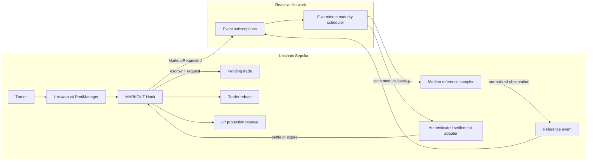

# MARKOUT

MARKOUT is a research-oriented Uniswap v4 hook that settles a provisional hook surcharge after observing a trade's post-execution markout.

Ordinary or inventory-improving flow receives a rebate. Flow that is followed by a favorable market move for the trader retains more of the surcharge for LP protection. Reactive Network is the autonomous observation and settlement layer: it watches hook and reference-market events, waits for the selected maturity horizon, and sends an authenticated callback to settle each trade.

## UHI10 alignment

- Primary UHI idea: **Fee-Rebate Systems tied to order-flow quality**
- Secondary idea: **Hybrid Routing between private orderflow and public Uniswap pools**
- Theme: **Sustainable Liquidity and MEV Protection**

## Research question

Can delayed, outcome-based fee settlement reduce LP adverse selection while charging benign traders less than a volatility-only dynamic-fee policy?

## MVP scope

- One ETH/USDC-style Uniswap v4 pool on Unichain Sepolia
- A fixed base LP fee plus a bounded provisional hook surcharge
- One deterministic markout horizon and one reference-market stream
- Reactive Network event subscriptions, maturity scheduling, and authenticated callbacks
- Pull-based trader rebates and an LP protection reserve
- A reproducible experiment comparing fixed fee, volatility fee, and MARKOUT

MARKOUT is an experimental hackathon prototype, not audited production software.

## Project documents

- [Roadmap](ROADMAP.md)
- [Mechanism specification](docs/MECHANISM.md)
- [Phase 1 accounting specification](docs/ACCOUNTING.md)
- [Phase 1 verification guide](docs/PHASE_1_VERIFICATION.md)
- [Phase 2 economic specification](docs/ECONOMICS.md)
- [Phase 2 verification guide](docs/PHASE_2_VERIFICATION.md)
- [Phase 3 lifecycle and accounting specification](docs/LIFECYCLE.md)
- [Phase 3 verification guide](docs/PHASE_3_VERIFICATION.md)
- [Reactive lifecycle specification](docs/REACTIVE_LIFECYCLE.md)
- [Phase 4 verification guide](docs/PHASE_4_VERIFICATION.md)
- [Phase 5 verification guide](docs/PHASE_5_VERIFICATION.md)
- [Phase 6 research experiment](experiments/README.md)
- [Phase 6 verification guide](docs/PHASE_6_VERIFICATION.md)
- [Phase 7 threat model](docs/THREAT_MODEL.md)
- [Phase 7 static-analysis report](docs/STATIC_ANALYSIS.md)
- [Phase 7 verification guide](docs/PHASE_7_VERIFICATION.md)
- [Phase 8 judge application](web/README.md)
- [Phase 8 verification guide](docs/PHASE_8_VERIFICATION.md)
- [Judge demo script](docs/DEMO_SCRIPT.md)
- [Final submission checklist](docs/SUBMISSION_CHECKLIST.md)
- [Phase 9 draft verification guide](docs/PHASE_9_DRAFT_VERIFICATION.md)
- [UHI10 presentation deck](presentation/MARKOUT-UHI10.pptx)
- [Testnet deployment runbook](docs/TESTNET_DEPLOYMENT.md)
- [Dependency policy](docs/DEPENDENCIES.md)
- [Verification protocol](docs/VERIFICATION.md)
- [Project decisions](docs/DECISIONS.md)

## Current status

**Phase 9 token-independent draft package implemented; Phase 5's live gate remains open.** The private judge dashboard,
final architecture diagram, four-minute demo script, nine-slide deck, and submission checklist are ready for review.
Every artifact visibly labels the missing Lasna evidence instead of inventing transactions. A funded scheduler, two
public settlements, explorer links, final recording, owner form details, and visibility decisions still require lREACT
or manual approval before Phase 5, Phase 8, and the final Phase 9 gate can close.

## Architecture



Reactive Network is not a notification layer in this design. It owns maturity timing, requests the reference sample,
retries delivery, and routes the authenticated terminal callback. The hook alone owns custody and final accounting.

```text
src/
├── adapters/    authenticated settlement boundary
├── base/        reusable PoolManager custody and accounting
├── hooks/       surcharge policy and complete MARKOUT lifecycle
├── interfaces/  stable external errors, events, and read API
├── libraries/   accounting, price, observation, and markout primitives
├── reactive/    event subscriptions, maturity scheduling, callback retries
├── reference/   authenticated, source-specific price sampling
└── types/       shared domain types
```

`BaseProvisionalSurcharge` isolates v4 custody. `MarkoutSettlementEngine` isolates pure economic evaluation.
`MarkoutHook` composes them into a replay-protected state machine. `MarkoutReactive` independently orchestrates events
and time, while `ReactiveMarkoutSettlementAdapter` is the narrow destination authentication boundary.

## Local verification

Prerequisites: Git, Foundry `v1.7.1`, Python `3.12`, uv `0.12.5`, and recursive submodules.

```bash
git submodule update --init --recursive
./scripts/verify-phase-5-local.sh
./scripts/verify-phase-6.sh
./scripts/verify-phase-7.sh
./scripts/verify-phase-8.sh
./scripts/verify-phase-9-draft.sh
```

The cumulative local gate checks formatting, compilation and bytecode size, lint, all earlier accounting and lifecycle
properties, autonomous sampling through the official Reactive simulator, stateful invariants, readable demos, the
committed gas snapshot, and current public testnet dependencies. See the
[Phase 5 verification guide](docs/PHASE_5_VERIFICATION.md) for the local/live boundary.

The Phase 6 command repeats the deployment-independent Solidity gate, then regenerates the seeded research artifacts
in a temporary directory and byte-compares them with the committed results. See the
[Phase 6 verification guide](docs/PHASE_6_VERIFICATION.md) for the metric boundary and observed regressions.

The Phase 7 command additionally verifies the locked Python security environment and runs Slither with a gate that
rejects every medium- or high-severity result. See the [Phase 7 verification guide](docs/PHASE_7_VERIFICATION.md) for
the adversarial cases, reviewed low-severity findings, and residual risks.

The Phase 8 command adds the Cloudflare-compatible judge application: lint, production build, server-rendered product
tests, exact social-card dimensions, and a production-dependency audit. Run `./scripts/run-phase-8-demo.sh` for the
one-command local demo, then open `http://localhost:3000`.

The Phase 9 draft command validates the token-independent submission package and the nine-slide PowerPoint archive.
It intentionally does not create the final release tag or claim that public Reactive evidence exists.

## Security status

This repository is production-shaped, not production-certified. Its implemented surfaces have defensive parsing,
explicit bounds, conservation checks, adversarial tests, stateful invariants, and zero medium/high Slither findings.
Phase 7 is an internal engineering review, not an independent audit. The three-pool spot reference, immutable
configuration, unsupported exotic tokens, and undistributed LP reserve remain explicit prototype limitations. Do not
deploy it with real funds.
