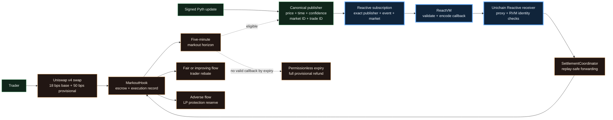

# Reactive-First Settlement Architecture

Status: final UHI10 architecture. The filename is retained so existing links do not break.

## 1. Objective

MARKOUT must evaluate a swap only after its five-minute markout horizon without giving a keeper, relayer, or oracle
custody over the provisional surcharge. Reactive Network is the primary event-to-action layer. It observes the
canonical Pyth-backed event on Ethereum Sepolia, executes the reaction in ReactVM, and requests an authenticated
callback on Unichain. The Uniswap v4 hook remains the sole owner of custody, validation, fee policy, and terminal
accounting.

If the observation or callback is unavailable, the trade fails open. After the immutable grace period, anyone can
expire the trade and the full provisional amount becomes claimable by the trader.

## 2. Current end-to-end flow



```text
1. A real Uniswap v4 swap creates a unique pending trade and locks a bounded provisional amount.
2. The trade becomes eligible only after its immutable five-minute maturity.
3. The publisher verifies a fresh signed Pyth update and emits one normalized observation event.
4. MarkoutPulseReactive subscribes to that exact publisher, event signature, and market topic.
5. ReactVM validates the event and encodes the Unichain callback payload.
6. The destination receiver authenticates both the callback proxy and injected ReactVM identity.
7. SettlementCoordinator forwards only a valid pending trade to MarkoutHook.
8. The hook revalidates time, confidence, market, direction, and solvency, then allocates exactly once.
9. If no valid callback arrives, permissionless expiry returns the complete provisional amount.
```

## 3. Why Reactive Network is integral

A Uniswap hook executes only when it is called. It cannot wake itself at the observation horizon, subscribe to a
foreign-chain event, or initiate a destination action. Reactive Network supplies that missing control plane:

- **Exact subscription:** pins the Ethereum Sepolia chain, canonical publisher, event signature, and market topic.
- **Event-native execution:** ReactVM reacts to the observation instead of relying on a MARKOUT-operated polling bot.
- **Authenticated callback:** the destination accepts the system callback proxy only when it carries the configured
  ReactVM identity.
- **Minimal authority:** Reactive can request settlement but cannot create the price, choose the fee, redirect a
  rebate, withdraw escrow, or override expiry.
- **Replay-safe delivery:** at-least-once callbacks are safe because terminal trade state makes duplicates no-ops.

Reactive is therefore essential to automation but deliberately excluded from economic discretion.

## 4. Responsibility boundaries

### MarkoutHook on Unichain

- Custodies every provisional surcharge.
- Stores execution price, direction, beneficiary, maturity, and expiry.
- Revalidates observation maturity, freshness, confidence, market, and settlement window.
- Computes directional markout and divides escrow into rebate plus LP protection.
- Enforces solvency, one terminal transition, and permissionless full-refund expiry.

### Canonical Pyth publisher on Ethereum Sepolia

- Verifies the configured Pyth contract and feed.
- Normalizes price, observation time, and confidence.
- Binds the observation to one market ID and trade ID.
- Emits the event consumed by the exact Reactive subscription.

The ETH/USDC testnet configuration uses Pyth ETH/USD as a proxy and assumes USDC remains close to one dollar. A
production deployment must use a direct pair source or independently validate the quote asset.

### Reactive Network

- Observes the canonical publisher event.
- Validates event topics and decodes the normalized payload in ReactVM.
- Requests the callback to the immutable Unichain receiver.
- Holds no user funds and has no fee-setting or recipient-selection authority.

### ReactiveObservationReceiver and SettlementCoordinator

- Require the configured callback proxy and injected ReactVM identity.
- Forward only the minimal `(marketId, tradeId, priceX18, observedAt, confidenceBps)` payload.
- Reject unknown trades and unauthenticated callbacks.
- Treat duplicate delivery after settlement or expiry as a successful no-op.

## 5. Public Reactive evidence

| Evidence | Status |
| --- | --- |
| Stateless Legacy RSC deployed and funded | Verified |
| Exact publisher and market subscription | Verified |
| ReactVM execution | Verified publicly |
| Authenticated Unichain callback | Verified publicly in 11 seconds |
| Duplicate callback against a terminal trade | Verified as a safe no-op |
| Pending-first ReactVM reactions | Verified twice |
| Pending-first destination delivery | Timed out before expiry |
| Fail-open full provisional refund | Verified |

The 11-second callback proves the live Reactive transport boundary. It reached an already-terminal trade, so it is
not relabeled as a completed Reactive-first economic allocation. The separate pending-first run reached ReactVM twice
but not the destination relayer; expiry returned the full provisional amount. This distinction keeps the sponsor
integration prominent without overstating what the transactions prove.

Machine-readable evidence is in [`deployments/reactive-legacy-2026-08-26.json`](../deployments/reactive-legacy-2026-08-26.json).

## 6. Liveness and failure policy

```text
PENDING -> SETTLED
PENDING -> EXPIRED
```

- A valid Reactive callback can settle a pending trade exactly once.
- A stale, early, late, low-confidence, wrong-market, or malformed observation leaves accounting unchanged.
- A duplicate callback after settlement or expiry cannot change the allocation.
- If the callback is unavailable, anyone can expire the trade after the grace period.
- Expiry credits the entire provisional amount to the trader and creates no LP protection value.

Reactive availability is therefore an automation assumption, never a custody assumption.

## 7. Historical compatibility module

The repository preserves the earlier Circle CCTP adapter, deployment scripts, and four public economic lifecycles.
Those artifacts prove both hook-allocation extremes, demonstrate an independently authenticated recovery design, and
document the project's resilience pivot. They are not the primary architecture of the final Reactive-first
submission. Current diagrams, README copy, and presentation material lead with the Reactive event-to-action path and
label the earlier CCTP records as historical evidence.

## 8. Production boundary

- The contracts are experimental and unaudited.
- A production release needs sustained Reactive relayer reliability across pending trades.
- The ETH/USD to ETH/USDC testnet proxy must be replaced or basis risk must be modeled explicitly.
- LP protection reserve distribution remains outside this prototype.
- The hook's expiry path must remain available even if every automation component is offline.
