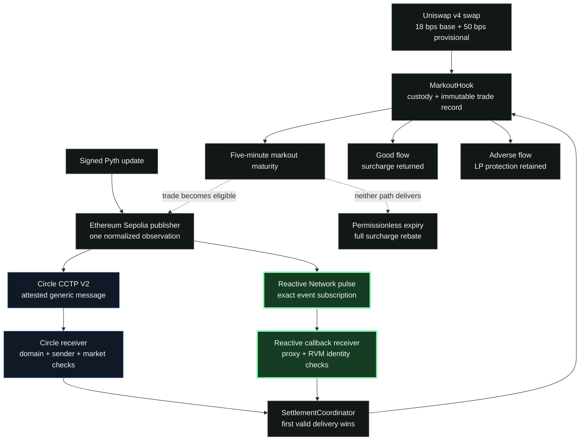

# Hybrid Settlement Architecture

Status: Phase 10 architecture freeze

## 1. Objective

MARKOUT must settle delayed post-trade outcomes without making user funds depend on one callback network. Circle CCTP
V2 is the primary authenticated cross-chain observation transport. Reactive Network is an optional, stateless
accelerator. The Uniswap v4 hook remains the sole owner of custody, economic validation, and terminal accounting.

## 2. End-to-end flow



The diagram gives Reactive visual prominence because it is the sponsor-specific automation layer, while preserving the
evidence boundary: the pulse deployment and exact subscription are public; a destination callback has not yet been
observed. Circle remains the publicly proven delivery path.

```text
Unichain swap
    -> MarkoutHook escrows a bounded provisional surcharge
    -> trade remains Pending until its immutable maturity

Permissionless publisher on Ethereum Sepolia
    -> submits a signed Pyth update and a Unichain trade id
    -> publisher normalizes price, time, and confidence
    -> emits one canonical observation event
    -> sends the same payload through Circle MessageTransmitterV2

Primary path: Circle
    -> Circle attests the generic message
    -> any relayer submits message + attestation on Unichain
    -> CircleObservationReceiver authenticates transmitter, source domain, source publisher, threshold, version, market
    -> SettlementCoordinator forwards the observation to MarkoutHook

Optional path: Reactive
    -> a legacy-compatible RSC observes the canonical Sepolia publisher event
    -> it forwards the identical payload through an authenticated Unichain callback
    -> SettlementCoordinator forwards it only if the trade is still Pending

Failure path
    -> after the existing grace period, anyone calls MarkoutHook.expireTrade
    -> the entire provisional surcharge becomes claimable by the trader
```

## 3. Responsibility boundaries

### MarkoutHook

- Custodies every provisional surcharge.
- Stores execution price, direction, maturity, expiry, and beneficiary.
- Re-validates observation maturity, freshness, confidence, and settlement window.
- Computes markout and divides escrow into rebate plus LP protection.
- Enforces solvency and permissionless full-rebate expiry.

Neither Circle nor Reactive can select a recipient, change a trade's execution data, bypass validation, withdraw hook
funds, or settle a terminal trade twice.

### SettlementCoordinator

- Is the hook's only settlement authority.
- Is bound once to the hook and a finite source set.
- Has no owner action after topology binding.
- Treats delivery as at-least-once: the first valid observation settles, later authorized deliveries are no-ops.

### Circle path

- The source publisher accepts no trusted reporter price; it obtains a fresh price from a configured Pyth contract and
  feed id.
- The testnet ETH/USDC configuration uses Pyth ETH/USD as a proxy and assumes USDC remains close to one dollar. This
  basis risk is explicit; production must use a direct pair source or separately validate the quote asset.
- Circle authenticates the application message between its Sepolia and Unichain transmitters.
- Destination delivery is permissionless. A relayer has no application authority because it cannot forge Circle's
  attestation or alter the attested body.
- The publisher requests Circle threshold `1000`, whose confirmed Ethereum path fits the ten-minute MARKOUT window.
- The receiver accepts threshold `1000–1999` only through Circle's unfinalized handler and threshold `2000+` only
  through its finalized handler. It permanently pins the source domain, publisher, market, and coordinator.
- Fast confirmation introduces bounded source-reorganization risk. The hook still enforces maturity, freshness,
  confidence, and its immutable settlement outcome; deployments requiring hard finality must widen the settlement
  window rather than pretending a 15–19 minute Ethereum message fits the current ten-minute grace period.

### Reactive path

- **Event-native trigger:** observes one exact publisher address and event signature rather than relying on a MARKOUT
  operator, polling service, or protocol-owned keeper.
- **Autonomous intent:** a matching observation event is sufficient for the RSC to construct the destination callback.
- **Minimal payload:** carries only `(marketId, tradeId, priceX18, observedAt, confidenceBps)`.
- **Least authority:** holds no authoritative trade registry, scheduler, oracle sampler, retry database, custody,
  fee policy, rebate recipient choice, or upgrade role.
- **Authenticated destination:** uses both callback-proxy and injected RVM-identity checks before the coordinator can
  see the observation.
- **Order-independent acceleration:** may settle before Circle, but coordinator idempotency makes Circle-first and
  Reactive-first economically identical.
- **Graceful degradation:** an unavailable callback cannot trap funds or change fees; Circle or permissionless expiry
  continues independently.

### Reactive public evidence

| Evidence | Status |
| --- | --- |
| Legacy Lasna pulse deployed and funded | Verified |
| Exact publisher subscription created by the constructor | Verified |
| Stateless payload and authenticated destination receiver | Verified in source and tests |
| Circle-first / Reactive-first race equivalence | Verified in tests |
| Public Unichain callback transaction | Not observed; not claimed live |

The sponsor-facing contribution is the architecture pattern: Reactive converts a canonical oracle event into a
cross-chain execution attempt without becoming a custodian or trusted fee controller. The unobserved relayer outcome
is reported as infrastructure evidence, not hidden or promoted as a successful callback.

## 4. Race and replay policy

Circle and Reactive may deliver the same observation in either order. The coordinator reads the hook's current trade
status before forwarding:

- `Pending`: forward and let the hook perform full economic validation.
- `Settled` or `Expired`: emit a duplicate-delivery event and return successfully without changing accounting.
- `None`: reject the unknown trade.

Circle's transmitter provides nonce replay protection for the message itself. MARKOUT's terminal state provides the
application-level replay boundary across different transports.

## 5. Liveness policy

Circle is the primary settlement path, but Circle availability is not a custody assumption. If no valid observation
settles before the grace period ends, `expireTrade` is permissionless and credits the complete provisional surcharge
as a rebate. An unavailable transport can reduce recorded LP protection; it cannot manufacture LP value or trap the
trader's escrow indefinitely.

## 6. Active and research implementations

The hybrid contracts become the active testnet topology. The existing `MarkoutReactive` Omni scheduler, callback
canaries, and deployment manifests remain in the repository as reproducible research and outage evidence. They must
not be described as the live settlement authority unless a public destination callback proves that claim.

## 7. Public-proof boundary

The complete contract and deployment logic can be verified locally. A generic EVM fork cannot reproduce Reactive's
chain-specific subscription precompile, so the optional pulse's constructor subscription must be proven by a live
legacy Lasna receipt. That limitation does not affect the Circle path, coordinator, hook, or full-rebate expiry.
